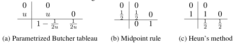
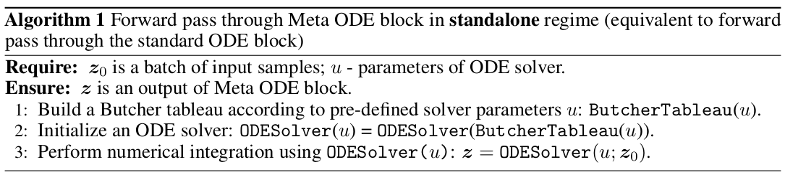
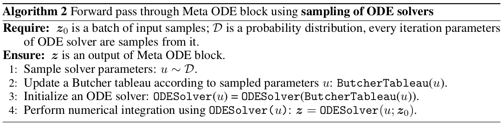
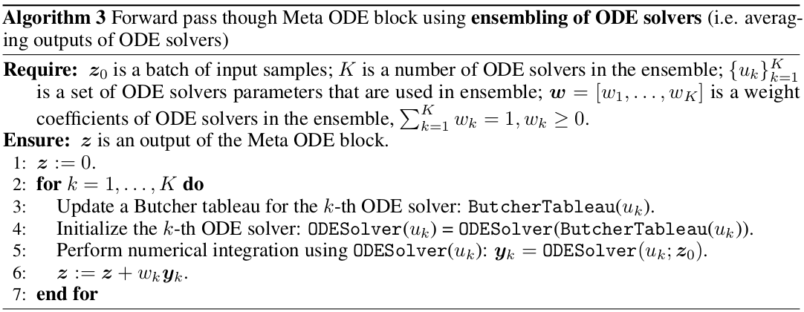
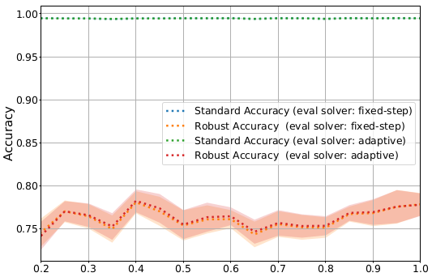
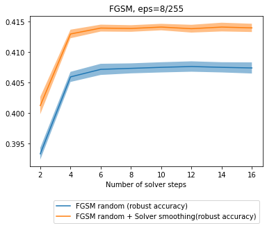
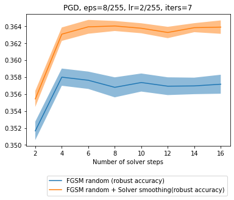
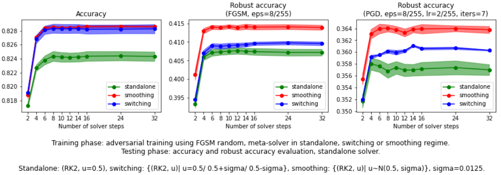

# Sampling and Ensembling of Solvers in Neural ODEs
Towards robust neural ODEs using sampling and ensembling techniques of parametrized ODE solvers.

# Main idea
Each *Runge-Kutta (RK)* solver with `s` stages and of `p`-th order is defined by a table of coefficients (*Butcher tableau*). For `s=p=2`, `s=p=3` and `s=p=4` all coefficient in the table can be parametrized with no more than two variables [1]. 

     

    <em>2-stage 2nd order Runge-Kutta methods, s=p=2</em>

Usually, during neural ODE training RK solver with fixed Butcher tableau is used, and only *right-hand side (RHS)* function is trained. We propose to use the whole parametric family of RK solvers to improve robustness of neural ODEs. 

# Requirements
- pytorch==1.7
- apex (for training)
- foolbox (FoolBox fork that allows to pass kwargs to  fmodel.forward(), for black-box attacks)

    `pip install git+https://github.com/SamplingAndEnsemblingSolvers/foolbox`
- robustbench (for black-box attacks)

# Examples
For CIFAR-10 and MNIST demo scripts and Jupyter notebooks, please,  check  `examples/cifar10` and `examples/mnist` folders, respectively.

# Meta ODE block
In the notebook `examples/cifar10/Evaluate model.ipynb` we show how to perform the forward pass through the Neural ODE using different regimes to propagate through the Meta ODE block, namely
- Standalone
- Solver sampling (switching/smoothing)
- Solver ensembling
- Model ensembling

In more details, usage of different regimes means
- **Standalone**
    - One solver is used during inference
    - Applied during training/testing.
    

         
    

    
- **Solver sampling (switching/smoothing)**
    - For each batch one solver is chosen from a group of solvers with finite (in switching regime) or infinite (in smoothing regime) number of members.
    - Applied during training.
    

      
    

    
- **Solver ensembling**
    - Several solvers are used durung inference.
    - Outputs of ODE block (obtained with different solvers) are averaged before propagating through the next layer.
    - Applied during training/testing
    

      
    

    
- **Model ensembling**
    - Several solvers are used durung inference.
    - Model probabilites obtained via propagation with different solvers are averaged to get the final result.
    - Applied during training/testing
    
# Selected results
## Diffrent solver parameterizations yield different robustness
- We have used MNIST classification task to illustrate the dependency of the neural ODE's robust accuracy on the choice of ODE solver. The model we trained consists of three stacked blocks: block of standard neural network layers, ODE block, and another block of neural network layers.
- To propagate through the ODE block we considered the 2-nd order two stages Runge-Kutta methods for various values of parameter *u* from the interval *(0,1]*. 
- We evaluated the robust accuracy using PGD attack with *epsilon = 0.3*, learning rate *2/255* and *7* iterations. 
- We see that models trained with different solver parameterizations yield different robust accuracies while maintaining similar standard accuracy.

## Solver sampling improves robustness
We have compared results of neural ODE adversarial training on CIFAR-10 dataset with Meta ODE block in standalone, switching or smoothing regimes. We choose 8-steps RK2 solvers for this experiment.
- We have performed training using FGSM random technique described in https://arxiv.org/abs/2001.03994 (with eps=8/255, alpha=10/255). 
- We have used cyclic learning rate schedule with one cycle (36 epochs, max_lr=0.1, base_lr=1e-7).
- We have measured robust accuracy of resulting models after FGSM (eps=8/255) and PGD (eps=8/255, lr=2/255, iters=7) attacks.
- We have used `premetanode10` architecture from `sopa/src/models/odenet_cifar10/layers.py` that has the following form 
`Conv -> PreResNet block -> ODE block -> PreResNet block -> ODE block ->  GeLU -> Average Pooling -> Fully Connected`
- We have computed mean and standard error across 3 random seeds.

<!---

-->

# References
[1] [Wanner, G., & Hairer, E. (1993). Solving ordinary differential equations I. Springer Berlin Heidelberg](https://www.springer.com/gp/book/9783540566700)
